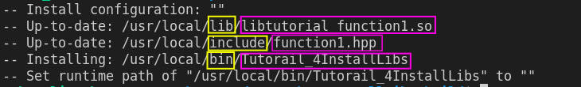
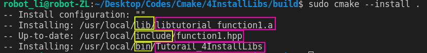

# Installing built libraries
This practice is to show
- how to write a CMakeLists.txt when want to install a library after building it from source codes
- why need to use install
- how to install libraries *somewhere else* using CMakeLists.txt


## Why we need "install"?
Everytime before learning something, we are encouraged to ask "why we need this". This is not only to activate the motiviation, but also to building our learning map where this new technique lays in the big picture.

Image, we want to build a bicycle at the beginning. A smart man never builds wheels. That is why we obtain others' wheels or codes from git. It is what we have done in 3ExternaLibs. We download the codes in the source folder and build the library from the codes.

Now we have a new situation. The wheels we obtain are so great. More than one project find it interesting. We use the wheels for our project bike, however the prject car can still needs it. Will we redo the proces- download again and build again?

No, it is completely waste of time. What we should do is to put the wheels in our "atelier" where all our projects can access. Moving the wheels to the atelier is the so-called **install**.

## How to install using Cmake
**Install** is to put the wheels in our atelier for every project. In our case, we can use executables or libraries *everwhere* not just in the orginal source directory. In Linux systems, the atelier is often set to be */usr/local*.

Three things must be moved into the atelier:
1. wheels -- *executables*,
2. elements -- *libraries*,
3. element index -- *header files*.
   
Then, we are able to take and use the wheels by calling *executables*. We also can find the wheels of the wheels, *libraries* used in *executables* and index book, i.e. *header files*, for both *wheels* and *libraries*.

Cmake provides the following commands
- for *executables*
    ```
    Install(TARGETS *executable* RUNTIME DESTINATION ${CMAKE_INSTALL_PREFIX}/bin)
    ```
- for *libraries*
  - static using ARCHIVE
    ```
    Install(TARGETS *libraries* ARCHIVE DESTINATION ${CMAKE_INSTALL_PREFIX}/lib)
    ``` 
  - dynamic using LIBRARY
    ```
    Install(TARGETS *libraries* LIBRARY DESTINATION ${CMAKE_INSTALL_PREFIX}/lib)
    ```   
- for *header files*
    ```
    Install(FILES **header files** INCLUDE DESTINATION ${CMAKE_INSTALL_PREFIX}/include)
    ```  

Then, we build and install the wheels as
```
cmake ..

cmake --build .

sudo cmake --install .
```  
Building a dynamic library is like 


while building a static library is like 


**NOTE**
Dynamic libraries in Linux requries addiontal configuration. Linux onlys searchs dynamic libraries at certain paths. The searching path is defined by a variable *LD_LIBRARY_PATH*.

We can check the searching path by 
```
echo $LD_LIBRARY_PATH
``` 

If our *${CMAKE_INSTALL_PREFIX}/lib*, */usr/local*, is not in the display, then Linux will not find our library during the running time. In order to fix this, we just need to add our install path to the *LD_LIBRARY_PATH*.

It can be done by adding one command in the *.bashrc*
```
LD_LIBRARY_PATH=$LD_LIBRARY_PATH:/usr/local/lib
``` 


## Find the installed libraries
In Linux, we can find a file/executable's location with the following command
```
sudo find / -name libtutorial_function1.so # search libtutorial_function1.so for example
```  


# Source
1. Code, Tech, and Tutorials, CMake Tutorial EP 6 | Installing Your Software! (part 1/2 of install), [link](https://www.youtube.com/watch?v=x7l31sbQDGk&list=PLalVdRk2RC6o5GHu618ARWh0VO0bFlif4&index=6&ab_channel=Code%2CTech%2CandTutorials).
2.  Juste Un Petit Cours, Cmake Installation, [link](https://www.youtube.com/watch?v=IuNdhR8-rGs&list=PLnLgSm1YaX18rzqCMd-AE8VEgz8j45MMD&index=10&ab_channel=JusteUnPetitCours).
3.  CMake, install, [link](https://cmake.org/cmake/help/v3.21/command/install.html#imported-runtime-artifacts).
4.  Juste Un Petit Cours, Cmake/Linux Installation Sans Droit Administrateur, [link](https://www.youtube.com/watch?v=JA0x6A8lkek&list=PLnLgSm1YaX18rzqCMd-AE8VEgz8j45MMD&index=11&ab_channel=JusteUnPetitCours).
5.  [link](https://gitlab.kitware.com/cmake/community/-/wikis/doc/tutorials/How-To-Find-Libraries)


